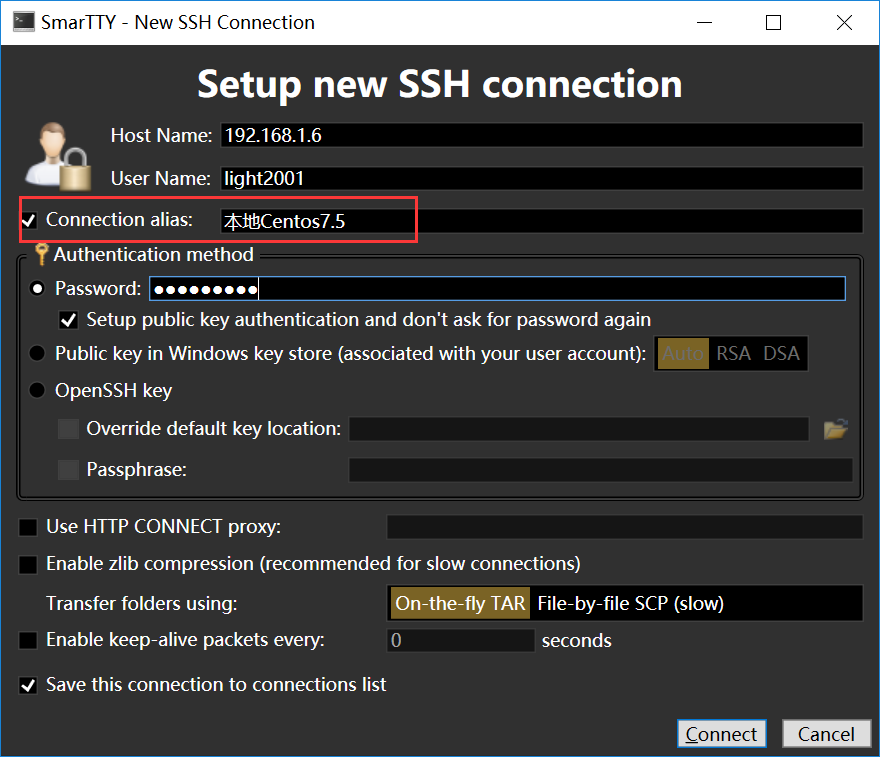
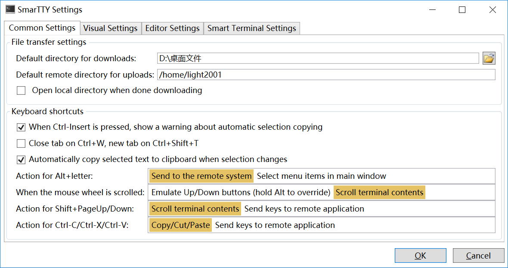
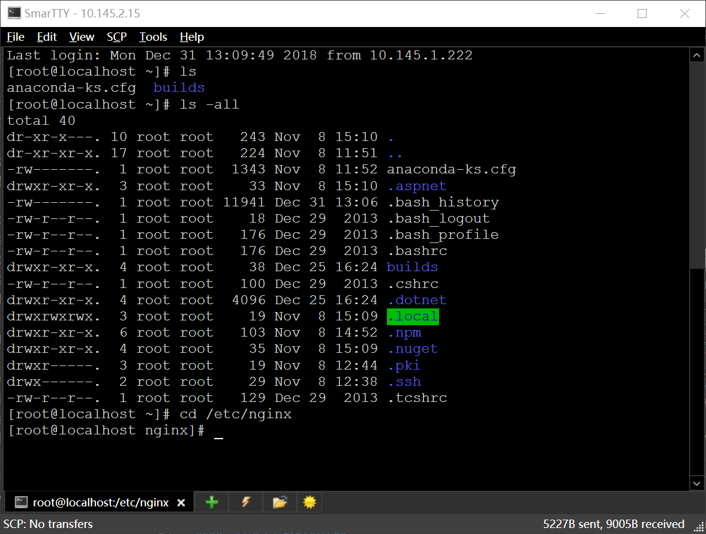
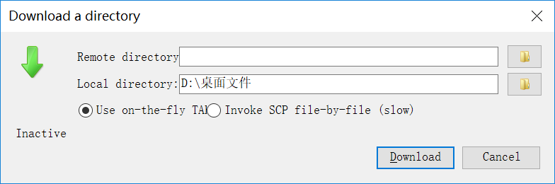
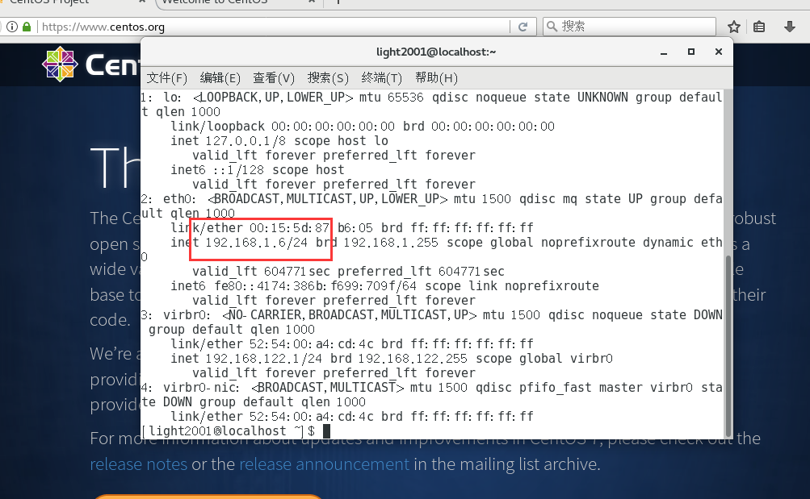

#### Centos基础知识
    
    Centos自带yum包管理器，可以利用yum安装卸载，更新常用软件

    yum安装需要一个软件来源地址，建议导入阿里的镜像地址，否则速度会很慢

    常用的操作可以在gnome桌面完成，也可以用终端敲命令完成，本教程全部采用命令方式完成

    建议开启虚拟机后，用windows下的ssh软件连接，而不是在虚拟机内敲命令

    Centos默认是有防火墙的，必须关闭或者设置规则打开对应端口，才能访问，默认会开启ssh端口(22)

#### SSH软件选择

    SSH软件有很多，大多需要收费，免费好用的不多，这里推荐几款
    1. Smartty，免费好用的ssh软件，上传，下载文件也很方便，就是界面不够美观
    2. mobaxterm ，免费好用的ssh软件，免费版本不可商用，他还有收费版本，这个不考虑
    3. zoc7，收费的ssh软件，异常强大好用，但是收费很贵，需要破解使用
    4. xterm2，免费的ssh软件，界面很漂亮，也很简洁不多做介绍
    5. xshell,putty,cywin这些很多，可以尝试下，不做说明了
    6. git自带的gitbash也是一个很不错的ssh终端

    由于本人只使用免费软件，不做破解，因此本教程适用于Smartty，Smartty安装过于简单，这里就不提供教程了

    更新一波，最新发现win10自带的power shell也可以始用ssh，这下就不用安装任何额外的工具了

    使用方式很简单：

        ssh username@192.168.1.16 输入密码后就连接完毕了

[Smartty下载地址](http://smartty.sysprogs.com/)


#### Smartty使用方法

1. 打开主界面，新增SSH连接，在alias输入别名



2. 菜单栏-tools-settings,设置成如截图所示



3. 在终端界面输入命令，操纵centos



4. 文件传输界面，在菜单-SCP菜单，可以看到Download和Upload就是用来传输文件的，可以选择centos的路径和本地路径




#### 常用的centos命令介绍

    对于linux运维人员，必须掌握常用的命令，大部分命令都可以在百度找到，这里只列出一小部分
    1. ls 查看文件夹下的文件和目录
    2. cd 切换目录
    3. vi,vim，编辑文件，如果没有则创建
    4. cat展示文本文件的内容
    5. mkdir 创建目录
    6. touch 创建文件
    7. rm 删除文件或者文件夹，慎用
    8. copy(简写cp) 复制文件
    9. move(简写mv) 移动文件
    10. ping 测试本地是否能打开某个域名
    11. curl url 向指定的网址发起访问
    12. wget 下载文件


更详细的命令可以百度，这里给出两个链接

[1. Centos7常用命令](https://blog.csdn.net/qq_40087415/article/details/79367151)

[2. Centos常用命令](https://www.cnblogs.com/benbenduo/p/3864809.html)


#### 导入阿里云的软件源
1. 在终端输入：

```
sudo wget -O /etc/yum.repos.d/CentOS-Base.repo http://mirrors.aliyun.com/repo/Centos-7.repo
```
2. 如果网络能正常连接的话，就能看到提示成功的标志

#### Centos服务器安装SSH服务
1. 在终端输入：
```
sudo yum install openssh*
```
进行安装


2.  在终端输入命令，加入开机启动
```
sudo systemctl enable sshd  
sudo systemctl start sshd

```
 
#### 用ssh连接Centos

    要连上Centos，首先要知道对应Centos的IP地址，获取方法是在终端输入ip address，查看到对应的ip地址，然后在Smartty里新建ssh连接，输入地址，用户密码，连接

1. 在Centos桌面，右键单击-打开终端
2. 在终端输入命令：ip address show eth0 (如果找不到eth0也可以 只输入ip address)
3. 如截图所示，IP地址为192.168.31.120




4. 打开Smartty，新增SSH连接，在其中IP地址输入192.168.31.120，用户密码输入对应的即可


#### 安装常用软件（在终端安装，不在熬述终端的使用方法）
1. 安装vim，vim是终端操作最常用的软件，必须安装
```
sudo yum install vim -y
```
2. 安装nginx并启动
```
# 安装基础软件
sudo yum install epel-release -y
# 安装nginx
sudo yum install nginx -y

# 启动：

sudo systemctl start nginx
sudo systemctl enable nginx
```
3. 安装docker
```
# 安装基础软件：

sudo yum install -y yum-utils device-mapper-persistent-data lvm2

# 配置阿里的镜像仓库
sudo yum-config-manager --add-repo http://mirrors.aliyun.com/docker-ce/linux/centos/docker-ce.repo

# 安装Docker

sudo yum makecache fast

sudo yum -y install docker-ce


# 把默认用户加入docker用户组
由于默认情况下，你新建的用户不是管理员用户，因此每次始用docker命令，都需要输入sudo docker xxx
这样很不方便，因此需要这步操作

# 应用用户加入docker用户组
sudo usermod -aG docker ${USER}
# 重启docker服务
sudo systemctl restart docker
# 切换或者退出当前账户再从新登入
su root             切换到root用户
su ${USER}          再切换到原来的应用用户以上配置才生效
配置完毕测试下就知道了

```

4. 安装docker-compose
```
必须切换到root用户才能安装

#安装
sudo curl -L https://github.com/docker/compose/releases/download/1.17.1/docker-compose-`uname -s`-`uname -m` > /usr/local/bin/docker-compose

#授权命令
sudo chmod +x /usr/local/bin/docker-compose

```

5. 安装.Net CoreSDK
```
# 导入rpm源
sudo rpm -Uvh https://packages.microsoft.com/config/rhel/7/packages-microsoft-prod.rpm
# 更新软件包
sudo yum -y update
# 安装SDK
sudo yum -y install dotnet-sdk-2.1
# 校验是否安装成功
dotnet --version

```

