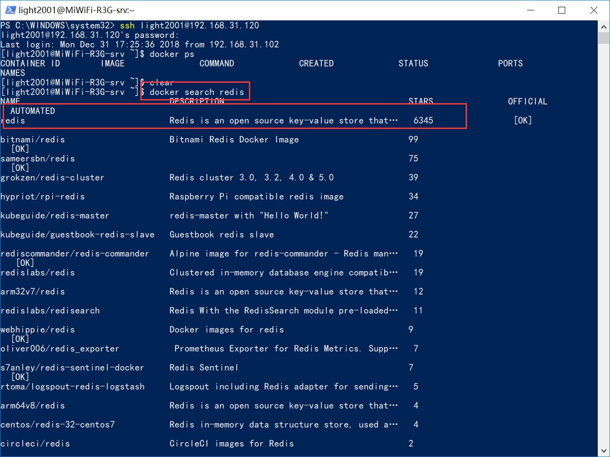
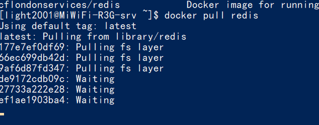
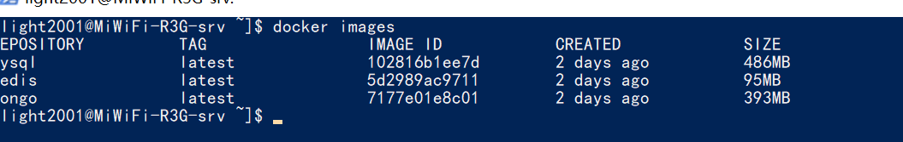
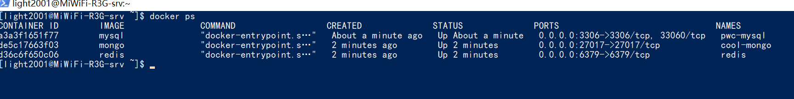

#### Docker 介绍
    Docker 是一个开源的应用容器引擎，让开发者可以打包他们的应用以及依赖包到一个可移植的容器中，
    然后发布到任何流行的 Linux 机器上，也可以实现虚拟化。
    容器是完全使用沙箱机制，相互之间不会有任何接口。(来自百度百科)

    简单来说，docker就是当前虚拟化技术的最佳实现方式
    可以把docker理解为，一个运行在主机中的软件，因为他的完全是用进程来实现的，
    可以把端口绑定到宿主机，便于访问
    一个打包好的docker容器可以轻易的安装，复制，减轻了了环境安装的大量工作


#### Docker使用步骤
    
    Docker的使用步骤一般为：
    1. 搜索镜像
    2. 下载镜像
    3. 根据镜像启动容器(把镜像启动起来，就叫做容器)
    4. 开启防火墙对应端口

#### Docker常用操作命令
1. docker --version 查看docker版本
2. docker ps 查看docker 容器列表
3. docker run 启动docker容器
4. docker images 查看docker镜像列表
5. docker start 启动已关闭的容器
6. docker exec -it 容器id /bin/bash 进入容器的终端

更多的docker 教程，推荐看以下链接的文档

[Docker从入门到实践](https://legacy.gitbook.com/book/yeasy/docker_practice/details)

#### 本次安装软件列表
1. redis
2. mongodb
3. mysql

安装步骤

1. 安装redis 
    1. 终端中输入：docker search redis
    2. 根据列表中的结果，一般是选择下载量最大的那个
    3. 如图所示，这里第一个就是下载量最大的

    

    4. 输入:docker pull redis
    5. 如图所示，将开始下载redis的镜像

    

2. 安装mongodb

    和上一步一样，这里就不细说搜索部分
    1. 输入：docker pull mongo就会开始安装mongodb

3. 安装mysql

    1. 输入：docker pull mysql就会开始安装mysql

    
    是不是感觉相当简单，是的，这就是docker的魅力
4. 安装完毕后，检查镜像列表，是否正确

    
    
    如图所示，已经安装完毕，redis,mysq,mongod都在本地镜像列表里了

#### 运行容器
1. 运行redis
```
docker run -p 6379:6379 --name redis -v /d/docker/data/redis:/data  -d redis redis-server --appendonly yes
```
2. 运行mongodb
```
docker run --name cool-mongo -p 27017:27017 -d mongo
```
3. 运行mysql

```
sudo docker run --name pwc-mysql -e MYSQL_ROOT_PASSWORD=123456 -p 3306:3306 -d mysql
```

4. 运行禅道
```
mkdir -p /data/zbox && docker run -d -p 81:80 -p 3306:3306 \
        -e USER="root" -e PASSWD="password" \
        -e BIND_ADDRESS="false" \
        -e SMTP_HOST="163.177.90.125 smtp.exmail.qq.com" \
        -v /data/zbox/:/opt/zbox/ \
        --privileged=true \
        --name zentao-server \
        idoop/zentao:latest

```

5. 查看运行列表
```
输入：docker ps,查看当前运行的容器
```



#### 防火墙设置

    默认情况下，是有防火墙的，如果不用可以关闭，但是强烈建议开启防火墙，只开放需要的端口白名单，这样会安全一点

在终端输入以下命令完毕，最后查看结果，如截图所示
```
firewall-cmd --zone=public --add-port=80/tcp --permanent （--permanent永久生效，没有此参数重启后失效）
firewall-cmd --zone=public --add-port=8080/tcp --permanent
firewall-cmd --zone=public --add-port=3306/tcp --permanent
firewall-cmd --zone=public --add-port=27017/tcp --permanent
firewall-cmd --zone=public --add-port=6379/tcp --permanent
处理完毕还需要重新读取配置，才可以生效
firewall-cmd --reload

```

    至此，docker的安装过程就结束了，本教程写的比较仓促，如果有疏漏，尽请谅解
    